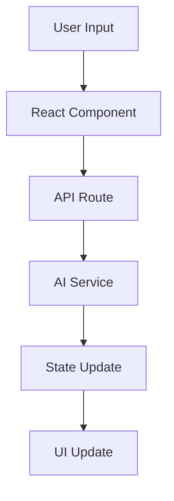

# Liminal Backrooms - Architecture Overview

## System Architecture

### High-Level Overview

```
┌─────────────────┐     ┌─────────────────┐     ┌─────────────────┐
│   Next.js App   │────▶│   API Routes    │────▶│   AI Services   │
└─────────────────┘     └─────────────────┘     └─────────────────┘
        │                       │                        │
        │                       │                        │
        ▼                       ▼                        ▼
┌─────────────────┐     ┌─────────────────┐     ┌─────────────────┐
│  React Client   │     │  State Manager  │     │  Data Storage   │
└─────────────────┘     └─────────────────┘     └─────────────────┘
```

## Core Components

### 1. Frontend Layer
- **Next.js App Router**: Server-side rendering and API routes
- **React Components**: Modular UI components
- **TailwindCSS**: Utility-first styling
- **TypeScript**: Type safety and developer experience

### 2. API Layer
- **AI Integration Routes**: 
  - `/api/chat`: Main conversation endpoint
  - `/api/generate`: Image generation endpoint
  - `/api/branch`: Conversation branching endpoint
- **Middleware**: Authentication and request validation
- **Error Handling**: Standardized error responses

### 3. AI Services Integration
- **Primary**: Anthropic Claude for main conversation
- **Secondary**: OpenRouter for model fallback
- **Tertiary**: Replicate for image generation
- **Auxiliary**: DeepSeek for specialized reasoning

### 4. State Management
- **Conversation State**: Client-side React state
- **Persistence**: Local storage / Session storage
- **Branching Logic**: Graph-based state management

## Technical Decisions

### 1. Framework Choice
- **Next.js 14+**: 
  - App Router for improved routing
  - API Routes for backend functionality
  - Server Components for performance
  - Built-in TypeScript support

### 2. AI Integration Strategy
- **Multi-Model Approach**:
  ```typescript
  interface AIProvider {
    generate(prompt: string): Promise<string>;
    handleError(error: Error): void;
    getCapabilities(): string[];
  }
  ```
- **Fallback Chain**:
  1. Claude (Primary)
  2. GPT-4 (Fallback)
  3. Local Models (Emergency)

### 3. Data Flow


### 4. Performance Considerations
- Streaming responses
- Lazy loading components
- Edge caching for static assets
- Optimistic updates

## Security Measures

### 1. API Security
- Rate limiting
- Input validation
- API key rotation
- Request signing

### 2. Data Protection
- No sensitive data storage
- Secure environment variables
- XSS prevention
- CSRF protection

## Scalability

### 1. Horizontal Scaling
- Stateless API design
- Edge function compatibility
- Cache strategy

### 2. Performance Optimization
- Response streaming
- Incremental Static Regeneration
- Dynamic imports

## Development Workflow

### 1. Local Development
```bash
# Development
npm run dev

# Type Checking
npm run type-check

# Linting
npm run lint
```

### 2. Deployment
```bash
# Production Build
npm run build

# Deploy
vercel deploy
```

## Future Considerations

### 1. Planned Improvements
- WebSocket integration for real-time updates
- Worker threads for heavy computations
- Advanced caching strategies

### 2. Monitoring
- Error tracking
- Performance monitoring
- Usage analytics

## Directory Structure
```
my-backrooms-app/
├── app/
│   ├── api/
│   │   ├── chat/
│   │   ├── generate/
│   │   └── branch/
│   ├── components/
│   │   ├── chat/
│   │   ├── visualization/
│   │   └── common/
│   └── features/
│       ├── conversation/
│       ├── branching/
│       └── memory/
├── lib/
│   ├── ai/
│   ├── types/
│   └── utils/
└── public/
    └── assets/
```

## Configuration

### 1. Environment Variables
```env
ANTHROPIC_API_KEY=
OPENROUTER_API_KEY=
REPLICATE_API_TOKEN=
```

### 2. TypeScript Configuration
- Strict mode enabled
- Path aliases configured
- ESNext target

## Testing Strategy

### 1. Unit Tests
- Component testing
- Utility function testing
- API route testing

### 2. Integration Tests
- AI service integration
- State management
- User flows

## Documentation Structure

### 1. Code Documentation
- TSDoc comments
- API documentation
- Component documentation

### 2. User Documentation
- Setup guide
- API reference
- Troubleshooting guide 